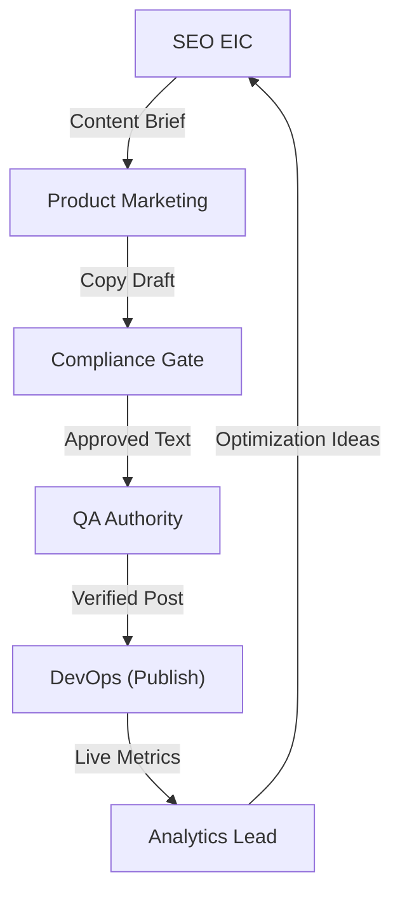
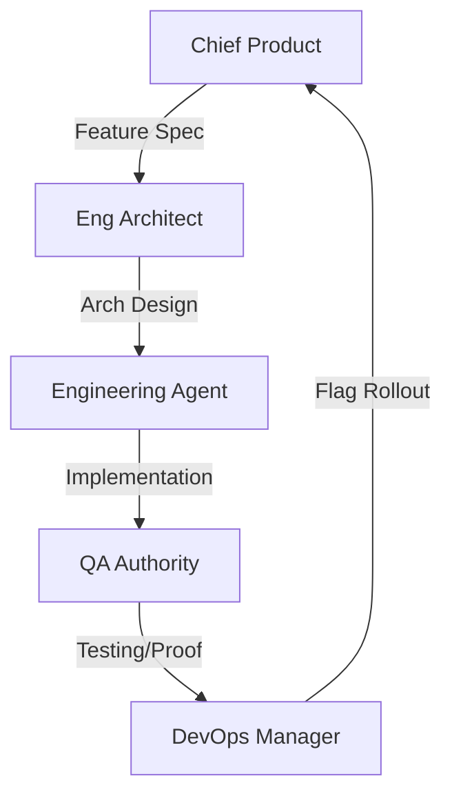
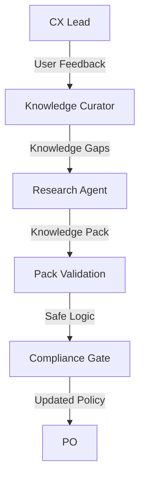

# AntiGravity Synergy Map

This document defines how agents work together to achieve complex goals.

## 1. The Growth & Content Loop (Vibration & Trust)

## 2. The Product & Engineering Loop (Build & Verify)

## 3. The Research & Feedback Loop (The Brain)

## 4. Master Control (The Governor)
- **Executive Orchestrator** monitors all loops via `/docs/os/scoreboard.md`.
- **Daily Program Manager** triggers cycles via `daily-cycle-run`.
- **Security Steward** monitors all directories (`/tasks/`, `/research/`) for access violations.
