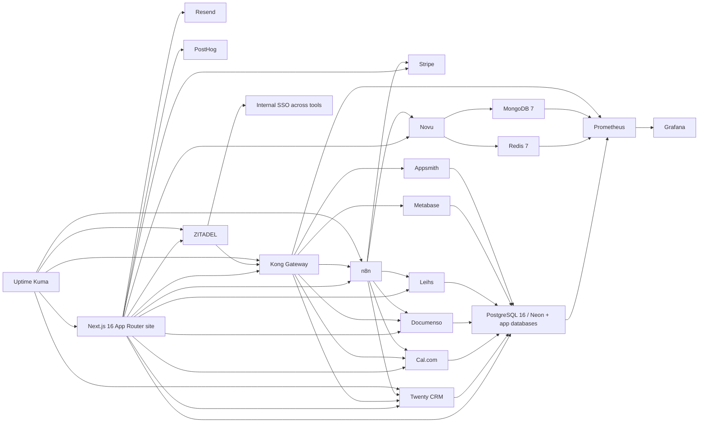

# Dependency and Overlap Analysis

## Dependency map

## Overlap recommendations
| Candidate A | Candidate B | Why they overlap | Recommendation |
|---|---|---|---|
| Invoice Ninja | Akaunting | Overlap ~70%+ around invoicing/accounting | Choose Invoice Ninja for focused quotes/invoices/payments; Akaunting only if a self-hosted accounting ledger is genuinely missing. |
| Discourse | Apache Answer | Community/forum vs focused Q&A | Choose Discourse if Hylono wants a real community. Choose Apache Answer only for a narrower Q&A/help surface. |
| BookStack | Outline | Internal docs / knowledge base | Choose BookStack for structured SOPs/runbooks. Choose Outline only if collaborative editing UX is more important than operational simplicity. |
| Documenso | DocuSeal | E-sign workflows | Evaluate Documenso first; keep DocuSeal as a secondary option unless its simpler AGPL stack is specifically preferable. |
| n8n | Node-RED | Automation overlap | Use n8n as default business/system automation. Bring in Node-RED only for MQTT/protocol-heavy IoT flows. |
| Jitsi | BigBlueButton | Video meetings / classrooms | Choose Jitsi for general meetings and consultations. Use BigBlueButton only for true classroom/training requirements. |
| Listmonk | Mautic | Email/newsletter/marketing automation | Start with Listmonk for newsletters. Use Mautic only if advanced nurture automation becomes necessary. |
| Novu + Listmonk/Mautic | Dittofeed | Customer engagement stack | Dittofeed is likely redundant until there is a specific lifecycle-marketing gap after Novu/Listmonk/Mautic decisions. |
| Leihs | Snipe-IT | Asset lending vs internal IT assets | Use Leihs for rental/lending operations. Use Snipe-IT only for internal IT asset management. |
| PostHog | Formbricks | Feedback/analytics adjacency | Keep PostHog for product analytics and feature flags; use Formbricks only for surveys/feedback. |
| Fides | CookieConsent / Presidio / Comp AI | Different privacy/compliance layers | Do not collapse these into one decision: CookieConsent is front-end consent UX, Presidio is PII detection, Fides is privacy operations, Comp AI is compliance operations. |
| MinIO | Alternative S3-compatible object storage | Object storage strategic choice | Do not standardize on MinIO for new work until current product/licensing direction is approved. |