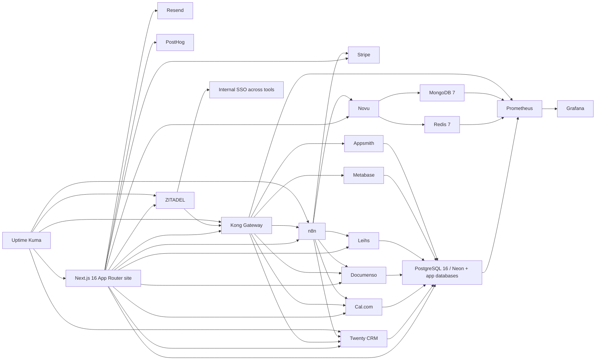

# 1. Executive Summary

- The Hylono stack can be simplified around a small number of backbone capabilities: **PostgreSQL, selected Redis/MongoDB use, object storage, identity, secrets, gateway, automation, notifications, monitoring, and internal tooling**.
- The strongest near-term implementation spine is: **PostgreSQL 16 hardening → Redis license decision → MongoDB only where required → ZITADEL → Infisical → Kong → n8n → Novu → Twenty → Cal.com → Documenso → Leihs → Prometheus/Grafana/Uptime Kuma → Metabase/Appsmith**.
- **Redis 7 licensing** requires explicit human review before Hylono expands its use materially.
- **MinIO** should not be treated as an unquestioned new default until its product/licensing direction is approved for Hylono.
- **PostHog** should likely remain in its current usage mode rather than triggering a self-host replatform without a compelling data-control reason.
- For Hylono’s health-adjacent, EU-sensitive business, the stack should prefer **conservative customer-facing surfaces**, **clear system-of-record boundaries**, **SSO and secrets centralization**, and **operator documentation / internal tooling** over speculative platform sprawl.

## Quick stack verdict
- **Deploy / harden early:** PostgreSQL 16, Redis 7 (with license review), MongoDB 7 (only where required), Uptime Kuma, ZITADEL, Infisical, Kong, n8n, Novu, Twenty CRM, Cal.com, Documenso, Leihs, Prometheus, Grafana.
- **High-value next wave:** Metabase, Appsmith, BookStack, CookieConsent, Listmonk, Invoice Ninja, Meilisearch, Formbricks, Chatwoot, Jitsi.
- **Conditional / later:** Medusa, Lago, CMMS, Strapi, Mautic, Dify, Discourse, Apache Answer, Node-RED, ThingsBoard, InfluxDB.
- **Heavy or likely delay / possible exclusion:** BigBlueButton, Temporal, Wazuh, Comp AI, Fides, Retraced, Fleetbase, Ditto, RefRef, ClassroomIO, Medplum, Fasten Health, Metriport, Akaunting.

# 2. Research Method

## Source priority used
1. Official product site and official docs
2. Official GitHub repo and official examples
3. Maintained community repos or starter assets
4. High-quality technical guides only where they added implementation detail
5. Release notes, issues/discussions, and a small amount of operator commentary when useful

## Evidence protocol used
- **CONFIRMED**: directly supported by official current source(s)
- **INFERRED**: best-fit interpretation when the app name was ambiguous (for example `CMMS`, `Ditto`)
- **UNVERIFIED**: could not be pinned confidently from current public sources
- **MISSING**: no reliable source found in current pass

## Recency rule used
- 2024–2026 sources were prioritized.
- Any clearly older asset or repo is flagged **[POTENTIALLY OUTDATED]** in the relevant package.

## License rule used
- Licenses are recorded per package where visible.
- GPL / AGPL / BSL / commercial / unclear licensing is explicitly flagged for human review before copying code or blueprints into Hylono repositories.

# 3. Master Stack Assessment

## Backbone and control-plane assessment
- **Database backbone:** PostgreSQL remains the default Hylono backbone. MongoDB should stay narrow and dependency-driven. Redis should remain dependency-driven and license-reviewed.
- **Identity and access:** ZITADEL is the strongest self-hosted identity anchor in this set.
- **Secrets and config:** Infisical is a strong fit because the stack is already too broad for ad hoc `.env` handling.
- **Gateway and service boundaries:** Kong becomes increasingly valuable as self-hosted services multiply.
- **Automation and notifications:** n8n + Novu + Twenty is the strongest immediate business-automation trio.
- **Observability:** Uptime Kuma adds quick operational visibility; Prometheus/Grafana provide real metrics discipline.
- **Ops tooling:** Metabase, Appsmith, and BookStack are high-leverage internal tools that reduce pressure to overbuild inside the public site.
- **Rental/service operations:** Leihs is the strongest rental/lending candidate; CMMS becomes useful later for maintenance; Snipe-IT is secondary for internal IT assets only.
- **Health-adjacent caution:** Medplum, Metriport, and Fasten Health should be treated as out-of-scope unless Hylono explicitly enters clinical/patient-data territory.

## Dependency / interoperability map

## Master index
| Order | App | Group | Status context | Version | Risk | Recommendation |
|---|---|---|---|---|---|---|
| 1 | PostgreSQL 16 | Infrastructure | RUNNING | 16.13 | High | DEPLOY/HARDEN NOW |
| 2 | Redis 7 | Infrastructure | RUNNING | 7.4.8 | Medium | KEEP FOR EXISTING USE; REQUIRE LICENSE REVIEW BEFORE EXPANSION |
| 3 | MongoDB 7 | Infrastructure | RUNNING | 7.0.x (7.0.31 observed in secondary release tracking) | Medium | KEEP FOR REQUIRED APPS ONLY |
| 4 | MinIO | Infrastructure | UNKNOWN | Community repo archived; AIStor docs active | High | DO NOT EXPAND UNTIL PRODUCT/LICENSE DIRECTION IS DECIDED |
| 5 | Uptime Kuma | Infrastructure | UNKNOWN | 2.2.1 | Low to Medium | DEPLOY EARLY |
| 6 | Twenty CRM | Phase 1A | RUNNING | v1.21.0 | Medium | KEEP AND DEEPEN INTEGRATION EARLY |
| 7 | Novu | Phase 1A | RUNNING | Platform v3.13.0 observed; JS SDK v3.14.0 also current | Medium | KEEP AND HARDEN EARLY |
| 8 | Medusa | Phase 1A | STOPPED | v2.13.6 | Medium | LATER / CONDITIONAL |
| 9 | Lago | Phase 1A | STOPPED | v1.45.1 | High | LATER / CONDITIONAL |
| 10 | Snipe-IT | Phase 1A | STOPPED | v8.4.1 | Medium | OPTIONAL / INTERNAL ONLY |
| 11 | Leihs | Phase 1A | STOPPED | 7.13.0 | Medium | PRIORITY CANDIDATE FOR RENTAL OPERATIONS |
| 12 | Cal.com | Phase 1A | STOPPED | v6.2.0 | Medium | EARLY HIGH-VALUE CANDIDATE |
| 13 | Documenso | Phase 1A | STOPPED | v2.8.0 | Medium | EARLY / CONDITIONAL WITH LEGAL REVIEW |
| 14 | ZITADEL | Phase 1A | STOPPED | v4.12.3 | High | FOUNDATIONAL EARLY CANDIDATE |
| 15 | n8n | Phase 1A | STOPPED | 2.15.1 stable (2.16.0 prerelease observed) | Medium | CORE EARLY AUTOMATION LAYER |
| 16 | Invoice Ninja | Phase 2 | UNKNOWN | v5.13.10 | Medium | PRIMARY INVOICING CANDIDATE IF NEEDED |
| 17 | Akaunting | Phase 2 | UNKNOWN | 3.1.21 observed | Medium | LIKELY EXCLUDE / ONLY IF ACCOUNTING GAP EXISTS |
| 18 | CMMS | Phase 2 | UNKNOWN | v1.4.0 | Medium | CONDITIONAL / GOOD FOR SERVICE OPERATIONS |
| 19 | Fleetbase | Phase 2 | UNKNOWN | v0.7.29 | High | LATER / ONLY IF FLEET OPERATIONS BECOME REAL |
| 20 | Ditto | Phase 2 | UNKNOWN | Current self-host docs available; exact stable version UNVERIFIED | High | LIKELY REDUNDANT / VERIFY IDENTITY FIRST |
| 21 | Node-RED | Phase 2 | UNKNOWN | 4.1.8 | Medium | LATER / IOT-SPECIFIC |
| 22 | DocuSeal | Phase 2 | UNKNOWN | 2.4.3 | Medium | SECONDARY TO DOCUMENSO |
| 23 | RefRef | Phase 2 | UNKNOWN | No stable releases; current repo active with alpha/breaking-change warnings | High | LATER / EXPERIMENTAL |
| 24 | Listmonk | Phase 2 | UNKNOWN | v6.1.0 | Medium | GOOD LIGHTWEIGHT MARKETING CANDIDATE |
| 25 | Discourse | Phase 2 | UNKNOWN | Current monthly channel / exact point release verify at implementation | Medium | CHOOSE ONLY IF COMMUNITY IS STRATEGIC |
| 26 | Apache Answer | Phase 2 | UNKNOWN | v2.0.0 | Medium | USE ONLY FOR FOCUSED Q&A |
| 27 | BigBlueButton | Phase 2 | UNKNOWN | v3.0.23 | High | LATE / ONLY IF CLASSROOM FEATURES ARE REQUIRED |
| 28 | BookStack | Phase 2 | UNKNOWN | v25.12.9 | Low to Medium | STRONG INTERNAL DOCS CANDIDATE |
| 29 | Docusaurus | Phase 2 | UNKNOWN | v3.10.0 | Medium | OPTIONAL / ONLY IF SEPARATE DOCS PROPERTY IS WANTED |
| 30 | Outline | Phase 2 | UNKNOWN | v1.6.1 | Medium | SECONDARY TO BOOKSTACK |
| 31 | Medplum | Phase 2 | UNKNOWN | v5.1.6 | High | DEFER UNLESS EXPLICIT HEALTHCARE DATA PROGRAM EXISTS |
| 32 | Fasten Health | Phase 2 | UNKNOWN | v1.1.3 observed [POTENTIALLY OUTDATED] | High | EXCLUDE FOR NOW |
| 33 | Presidio | Phase 2 | UNKNOWN | 2.2.362 | Medium | USE AS A COMPONENT IF PII PIPELINES EXIST |
| 34 | Infisical | Phase 2 | UNKNOWN | v0.159.9 | Medium | FOUNDATIONAL EARLY PLATFORM CANDIDATE |
| 35 | Comp AI | Phase 2 | UNKNOWN | v1.72.2 observed | Medium | LATER / ONLY IF FORMAL COMPLIANCE PROGRAM IS ACTIVE |
| 36 | PostHog | Phase 2 | ALREADY IN STACK | Current self-host docs reviewed; exact monorepo server version intentionally left UNVERIFIED | Medium | KEEP CURRENT USE; AVOID SELF-HOST REPLATFORM UNLESS REQUIRED |
| 37 | Retraced | Phase 2 | UNKNOWN | v1.13.1 [POTENTIALLY OUTDATED] | Medium | LATER / CONDITIONAL |
| 38 | Fides | Phase 2 | UNKNOWN | v2.78.2 | Medium | LATER / PRIVACY-PROGRAM DEPENDENT |
| 39 | CookieConsent | Phase 2 | UNKNOWN | v3.1.0 | Low to Medium | GOOD LIGHTWEIGHT CONSENT OPTION |
| 40 | Kong | Phase 2 | UNKNOWN | 3.14.0.1 | Medium | FOUNDATIONAL EARLY PLATFORM CANDIDATE |
| 41 | Prometheus | Phase 2 | UNKNOWN | v3.11.1 | Medium | DEPLOY IN OBSERVABILITY WAVE |
| 42 | Metabase | Phase 2 | UNKNOWN | v0.59.5 | Medium | HIGH-VALUE INTERNAL ANALYTICS TOOL |
| 43 | Appsmith | Phase 2 | UNKNOWN | v1.98 | Medium | HIGH-VALUE INTERNAL TOOLING CANDIDATE |
| 44 | ThingsBoard | Phase 1B | UNKNOWN | v4.3.1.1 | High | LATER / ONLY IF IOT STRATEGY IS REAL |
| 45 | Mosquitto | Phase 1B | UNKNOWN | v2.1.2 | High | DEFER UNTIL MQTT IS NEEDED |
| 46 | InfluxDB | Phase 1B | UNKNOWN | 3.9.0 Core | Medium | LATER / IF TIME-SERIES NEEDS BECOME REAL |
| 47 | Grafana | Phase 1B | UNKNOWN | 12.4.2 | Medium | DEPLOY WITH OBSERVABILITY STACK |
| 48 | Meilisearch | Phase 1B | UNKNOWN | v1.38.2 | Medium | LATER / HIGH-UTILITY IF SEARCH BECOMES IMPORTANT |
| 49 | Dify | Phase 1B | UNKNOWN | v1.13.3 | High | LATER / USE-CASE DRIVEN |
| 50 | Strapi | Phase 1B | UNKNOWN | v5.42.0 | Medium | ONLY IF CONTENT OPS OUTGROW CURRENT APPROACH |
| 51 | Jitsi | Phase 1B | UNKNOWN | stable-10888 | Medium | PRIMARY SELF-HOST VIDEO CANDIDATE IF NEEDED |
| 52 | Chatwoot | Phase 1C | UNKNOWN | v4.12.1 | Medium | LATER / GOOD SUPPORT PLATFORM |
| 53 | Mautic | Phase 1C | UNKNOWN | 7.0.1 | Medium | LATER / ONLY IF ADVANCED MARKETING AUTOMATION IS NEEDED |
| 54 | Formbricks | Phase 1C | UNKNOWN | v4.8.7 | Medium | GOOD LATER FEEDBACK TOOL |
| 55 | Gorse | Phase 1C | UNKNOWN | v0.5.5 | Medium | LATE / DATA-MATURITY DEPENDENT |
| 56 | Temporal | Phase 1C | UNKNOWN | v1.30.3 | High | LATE / ONLY FOR TRUE DURABLE-WORKFLOW NEEDS |
| 57 | ClassroomIO | Phase 1C | UNKNOWN | Release state UNVERIFIED (secondary trackers suggest v0.3.2) | High | VERIFY FRESHNESS BEFORE ANY USE / LIKELY LATER |
| 58 | Metriport | Phase 1C | UNKNOWN | v5.84.0 [POTENTIALLY OUTDATED] | High | EXCLUDE FOR NOW |
| 59 | Wazuh | Phase 1C | UNKNOWN | v4.14.4 | High | LATER / SECURITY-MATURITY DEPENDENT |

# 4. Recommended Rollout Order

## Wave 0 — Validate and harden current backbone
- PostgreSQL 16
- Redis 7
- MongoDB 7
- MinIO decision
- Uptime Kuma

**Why:** validate the already-running data plane, settle Redis licensing, and decide whether MinIO remains acceptable for new work.

## Wave 1 — Identity, secrets, gateway, and automation spine
- ZITADEL
- Infisical
- Kong
- n8n
- Novu
- Twenty CRM

**Why:** these tools create the shared control plane and integration backbone for the rest of the stack.

## Wave 2 — Customer operations and internal visibility
- Cal.com
- Documenso
- Leihs
- Prometheus
- Grafana
- Metabase
- Appsmith
- CookieConsent

**Why:** these immediately improve booking, signing, rental operations, monitoring, internal visibility, and front-end consent.

## Wave 3 — Revenue operations and support/content basics
- Lago (only if billing complexity exists)
- Invoice Ninja
- Listmonk
- Chatwoot
- BookStack
- Meilisearch
- Formbricks
- Jitsi

**Why:** these add specific customer and operator value once the backbone is stable.

## Wave 4 — Conditional platform expansion
- Medusa
- Snipe-IT
- CMMS
- Node-RED
- ThingsBoard
- Mosquitto
- InfluxDB
- Discourse / Apache Answer
- Strapi
- Mautic
- Dify

**Why:** these depend on confirmed business needs such as richer commerce, IoT, community, CMS, or AI.

## Wave 5 — Heavy, niche, or strategic-later systems
- DocuSeal
- Fleetbase
- BigBlueButton
- Outline
- Temporal
- Gorse
- Comp AI
- Fides
- Retraced
- Wazuh
- Ditto
- RefRef
- ClassroomIO
- Medplum
- Fasten Health
- Metriport
- Akaunting

**Why:** these are either redundant, operationally heavy, maturity-limited, or outside the current business center of gravity.

## Practical sequencing logic
- Validate what is already running before adding more.
- Stand up the **shared control plane** before connecting more customer-data systems.
- Prefer tools that create immediate leverage across multiple workflows (identity, secrets, gateway, automation, notifications, CRM, scheduling).
- Delay heavy systems until a concrete business requirement exists.

# 5. Cross-App Dependency and Overlap Analysis

## Overlap map with consolidation recommendations
| Candidate A | Candidate B | Why they overlap | Recommendation |
|---|---|---|---|
| Invoice Ninja | Akaunting | Overlap ~70%+ around invoicing/accounting | Choose Invoice Ninja for focused quotes/invoices/payments; Akaunting only if a self-hosted accounting ledger is genuinely missing. |
| Discourse | Apache Answer | Community/forum vs focused Q&A | Choose Discourse if Hylono wants a real community. Choose Apache Answer only for a narrower Q&A/help surface. |
| BookStack | Outline | Internal docs / knowledge base | Choose BookStack for structured SOPs/runbooks. Choose Outline only if collaborative editing UX is more important than operational simplicity. |
| Documenso | DocuSeal | E-sign workflows | Evaluate Documenso first; keep DocuSeal as a secondary option unless its simpler AGPL stack is specifically preferable. |
| n8n | Node-RED | Automation overlap | Use n8n as default business/system automation. Bring in Node-RED only for MQTT/protocol-heavy IoT flows. |
| Jitsi | BigBlueButton | Video meetings / classrooms | Choose Jitsi for general meetings and consultations. Use BigBlueButton only for true classroom/training requirements. |
| Listmonk | Mautic | Email/newsletter/marketing automation | Start with Listmonk for newsletters. Use Mautic only if advanced nurture automation becomes necessary. |
| Novu + Listmonk/Mautic | Dittofeed | Customer engagement stack | Dittofeed is likely redundant until there is a specific lifecycle-marketing gap after Novu/Listmonk/Mautic decisions. |
| Leihs | Snipe-IT | Asset lending vs internal IT assets | Use Leihs for rental/lending operations. Use Snipe-IT only for internal IT asset management. |
| PostHog | Formbricks | Feedback/analytics adjacency | Keep PostHog for product analytics and feature flags; use Formbricks only for surveys/feedback. |
| Fides | CookieConsent / Presidio / Comp AI | Different privacy/compliance layers | Do not collapse these into one decision: CookieConsent is front-end consent UX, Presidio is PII detection, Fides is privacy operations, Comp AI is compliance operations. |
| MinIO | Alternative S3-compatible object storage | Object storage strategic choice | Do not standardize on MinIO for new work until current product/licensing direction is approved. |

## Dependency clusters
- **Core shared infrastructure:** PostgreSQL, Redis, MongoDB, object storage, TLS / reverse proxy / backups.
- **Shared control plane:** ZITADEL, Infisical, Kong.
- **Shared workflow layer:** n8n, Novu, Twenty.
- **Shared ops visibility:** Uptime Kuma, Prometheus, Grafana, Metabase, Appsmith.
- **Shared content / docs / knowledge layer:** BookStack, Docusaurus, Discourse/Apache Answer, Strapi, Outline.
- **Specialized later domains:** IoT (Mosquitto, ThingsBoard, Node-RED, InfluxDB), privacy/compliance (Fides, Comp AI, Retraced, Wazuh), healthcare/clinical data (Medplum, Metriport, Fasten Health).

## Consolidation recommendations
- Default to **fewer systems with clearer boundaries**.
- Do not add a new datastore or auth plane unless the target app actually requires it.
- Prefer **separate services integrated to the Next.js site** over turning the public site into a universal admin frontend.

# 6. Per-App Research Packages

Each app package contains:
- `01-overview.md`
- `02-how-it-works.md`
- `03-setup-guide.md`
- `04-blueprints-and-assets.md`
- `05-integration-notes.md`
- `06-risks-and-caveats.md`
- `07-codex-handoff.md`
- `08-sources.md`
- `assets/ASSET-INDEX.md`
- `package-metadata.json`

## Package index
| App | Package folder | Zip package | Version | Recommendation |
|---|---|---|---|---|
| PostgreSQL 16 | `packages/postgresql-16/` | `zips/hylono-research-postgresql-16-2026-04-12.zip` | 16.13 | DEPLOY/HARDEN NOW |
| Redis 7 | `packages/redis-7/` | `zips/hylono-research-redis-7-2026-04-12.zip` | 7.4.8 | KEEP FOR EXISTING USE; REQUIRE LICENSE REVIEW BEFORE EXPANSION |
| MongoDB 7 | `packages/mongodb-7/` | `zips/hylono-research-mongodb-7-2026-04-12.zip` | 7.0.x (7.0.31 observed in secondary release tracking) | KEEP FOR REQUIRED APPS ONLY |
| MinIO | `packages/minio/` | `zips/hylono-research-minio-2026-04-12.zip` | Community repo archived; AIStor docs active | DO NOT EXPAND UNTIL PRODUCT/LICENSE DIRECTION IS DECIDED |
| Uptime Kuma | `packages/uptime-kuma/` | `zips/hylono-research-uptime-kuma-2026-04-12.zip` | 2.2.1 | DEPLOY EARLY |
| Twenty CRM | `packages/twenty-crm/` | `zips/hylono-research-twenty-crm-2026-04-12.zip` | v1.21.0 | KEEP AND DEEPEN INTEGRATION EARLY |
| Novu | `packages/novu/` | `zips/hylono-research-novu-2026-04-12.zip` | Platform v3.13.0 observed; JS SDK v3.14.0 also current | KEEP AND HARDEN EARLY |
| Medusa | `packages/medusa/` | `zips/hylono-research-medusa-2026-04-12.zip` | v2.13.6 | LATER / CONDITIONAL |
| Lago | `packages/lago/` | `zips/hylono-research-lago-2026-04-12.zip` | v1.45.1 | LATER / CONDITIONAL |
| Snipe-IT | `packages/snipe-it/` | `zips/hylono-research-snipe-it-2026-04-12.zip` | v8.4.1 | OPTIONAL / INTERNAL ONLY |
| Leihs | `packages/leihs/` | `zips/hylono-research-leihs-2026-04-12.zip` | 7.13.0 | PRIORITY CANDIDATE FOR RENTAL OPERATIONS |
| Cal.com | `packages/cal-com/` | `zips/hylono-research-cal-com-2026-04-12.zip` | v6.2.0 | EARLY HIGH-VALUE CANDIDATE |
| Documenso | `packages/documenso/` | `zips/hylono-research-documenso-2026-04-12.zip` | v2.8.0 | EARLY / CONDITIONAL WITH LEGAL REVIEW |
| ZITADEL | `packages/zitadel/` | `zips/hylono-research-zitadel-2026-04-12.zip` | v4.12.3 | FOUNDATIONAL EARLY CANDIDATE |
| n8n | `packages/n8n/` | `zips/hylono-research-n8n-2026-04-12.zip` | 2.15.1 stable (2.16.0 prerelease observed) | CORE EARLY AUTOMATION LAYER |
| Invoice Ninja | `packages/invoice-ninja/` | `zips/hylono-research-invoice-ninja-2026-04-12.zip` | v5.13.10 | PRIMARY INVOICING CANDIDATE IF NEEDED |
| Akaunting | `packages/akaunting/` | `zips/hylono-research-akaunting-2026-04-12.zip` | 3.1.21 observed | LIKELY EXCLUDE / ONLY IF ACCOUNTING GAP EXISTS |
| CMMS | `packages/cmms/` | `zips/hylono-research-cmms-2026-04-12.zip` | v1.4.0 | CONDITIONAL / GOOD FOR SERVICE OPERATIONS |
| Fleetbase | `packages/fleetbase/` | `zips/hylono-research-fleetbase-2026-04-12.zip` | v0.7.29 | LATER / ONLY IF FLEET OPERATIONS BECOME REAL |
| Ditto | `packages/ditto/` | `zips/hylono-research-ditto-2026-04-12.zip` | Current self-host docs available; exact stable version UNVERIFIED | LIKELY REDUNDANT / VERIFY IDENTITY FIRST |
| Node-RED | `packages/node-red/` | `zips/hylono-research-node-red-2026-04-12.zip` | 4.1.8 | LATER / IOT-SPECIFIC |
| DocuSeal | `packages/docuseal/` | `zips/hylono-research-docuseal-2026-04-12.zip` | 2.4.3 | SECONDARY TO DOCUMENSO |
| RefRef | `packages/refref/` | `zips/hylono-research-refref-2026-04-12.zip` | No stable releases; current repo active with alpha/breaking-change warnings | LATER / EXPERIMENTAL |
| Listmonk | `packages/listmonk/` | `zips/hylono-research-listmonk-2026-04-12.zip` | v6.1.0 | GOOD LIGHTWEIGHT MARKETING CANDIDATE |
| Discourse | `packages/discourse/` | `zips/hylono-research-discourse-2026-04-12.zip` | Current monthly channel / exact point release verify at implementation | CHOOSE ONLY IF COMMUNITY IS STRATEGIC |
| Apache Answer | `packages/apache-answer/` | `zips/hylono-research-apache-answer-2026-04-12.zip` | v2.0.0 | USE ONLY FOR FOCUSED Q&A |
| BigBlueButton | `packages/bigbluebutton/` | `zips/hylono-research-bigbluebutton-2026-04-12.zip` | v3.0.23 | LATE / ONLY IF CLASSROOM FEATURES ARE REQUIRED |
| BookStack | `packages/bookstack/` | `zips/hylono-research-bookstack-2026-04-12.zip` | v25.12.9 | STRONG INTERNAL DOCS CANDIDATE |
| Docusaurus | `packages/docusaurus/` | `zips/hylono-research-docusaurus-2026-04-12.zip` | v3.10.0 | OPTIONAL / ONLY IF SEPARATE DOCS PROPERTY IS WANTED |
| Outline | `packages/outline/` | `zips/hylono-research-outline-2026-04-12.zip` | v1.6.1 | SECONDARY TO BOOKSTACK |
| Medplum | `packages/medplum/` | `zips/hylono-research-medplum-2026-04-12.zip` | v5.1.6 | DEFER UNLESS EXPLICIT HEALTHCARE DATA PROGRAM EXISTS |
| Fasten Health | `packages/fasten-health/` | `zips/hylono-research-fasten-health-2026-04-12.zip` | v1.1.3 observed [POTENTIALLY OUTDATED] | EXCLUDE FOR NOW |
| Presidio | `packages/presidio/` | `zips/hylono-research-presidio-2026-04-12.zip` | 2.2.362 | USE AS A COMPONENT IF PII PIPELINES EXIST |
| Infisical | `packages/infisical/` | `zips/hylono-research-infisical-2026-04-12.zip` | v0.159.9 | FOUNDATIONAL EARLY PLATFORM CANDIDATE |
| Comp AI | `packages/comp-ai/` | `zips/hylono-research-comp-ai-2026-04-12.zip` | v1.72.2 observed | LATER / ONLY IF FORMAL COMPLIANCE PROGRAM IS ACTIVE |
| PostHog | `packages/posthog/` | `zips/hylono-research-posthog-2026-04-12.zip` | Current self-host docs reviewed; exact monorepo server version intentionally left UNVERIFIED | KEEP CURRENT USE; AVOID SELF-HOST REPLATFORM UNLESS REQUIRED |
| Retraced | `packages/retraced/` | `zips/hylono-research-retraced-2026-04-12.zip` | v1.13.1 [POTENTIALLY OUTDATED] | LATER / CONDITIONAL |
| Fides | `packages/fides/` | `zips/hylono-research-fides-2026-04-12.zip` | v2.78.2 | LATER / PRIVACY-PROGRAM DEPENDENT |
| CookieConsent | `packages/cookieconsent/` | `zips/hylono-research-cookieconsent-2026-04-12.zip` | v3.1.0 | GOOD LIGHTWEIGHT CONSENT OPTION |
| Kong | `packages/kong/` | `zips/hylono-research-kong-2026-04-12.zip` | 3.14.0.1 | FOUNDATIONAL EARLY PLATFORM CANDIDATE |
| Prometheus | `packages/prometheus/` | `zips/hylono-research-prometheus-2026-04-12.zip` | v3.11.1 | DEPLOY IN OBSERVABILITY WAVE |
| Metabase | `packages/metabase/` | `zips/hylono-research-metabase-2026-04-12.zip` | v0.59.5 | HIGH-VALUE INTERNAL ANALYTICS TOOL |
| Appsmith | `packages/appsmith/` | `zips/hylono-research-appsmith-2026-04-12.zip` | v1.98 | HIGH-VALUE INTERNAL TOOLING CANDIDATE |
| ThingsBoard | `packages/thingsboard/` | `zips/hylono-research-thingsboard-2026-04-12.zip` | v4.3.1.1 | LATER / ONLY IF IOT STRATEGY IS REAL |
| Mosquitto | `packages/mosquitto/` | `zips/hylono-research-mosquitto-2026-04-12.zip` | v2.1.2 | DEFER UNTIL MQTT IS NEEDED |
| InfluxDB | `packages/influxdb/` | `zips/hylono-research-influxdb-2026-04-12.zip` | 3.9.0 Core | LATER / IF TIME-SERIES NEEDS BECOME REAL |
| Grafana | `packages/grafana/` | `zips/hylono-research-grafana-2026-04-12.zip` | 12.4.2 | DEPLOY WITH OBSERVABILITY STACK |
| Meilisearch | `packages/meilisearch/` | `zips/hylono-research-meilisearch-2026-04-12.zip` | v1.38.2 | LATER / HIGH-UTILITY IF SEARCH BECOMES IMPORTANT |
| Dify | `packages/dify/` | `zips/hylono-research-dify-2026-04-12.zip` | v1.13.3 | LATER / USE-CASE DRIVEN |
| Strapi | `packages/strapi/` | `zips/hylono-research-strapi-2026-04-12.zip` | v5.42.0 | ONLY IF CONTENT OPS OUTGROW CURRENT APPROACH |
| Jitsi | `packages/jitsi/` | `zips/hylono-research-jitsi-2026-04-12.zip` | stable-10888 | PRIMARY SELF-HOST VIDEO CANDIDATE IF NEEDED |
| Chatwoot | `packages/chatwoot/` | `zips/hylono-research-chatwoot-2026-04-12.zip` | v4.12.1 | LATER / GOOD SUPPORT PLATFORM |
| Mautic | `packages/mautic/` | `zips/hylono-research-mautic-2026-04-12.zip` | 7.0.1 | LATER / ONLY IF ADVANCED MARKETING AUTOMATION IS NEEDED |
| Formbricks | `packages/formbricks/` | `zips/hylono-research-formbricks-2026-04-12.zip` | v4.8.7 | GOOD LATER FEEDBACK TOOL |
| Gorse | `packages/gorse/` | `zips/hylono-research-gorse-2026-04-12.zip` | v0.5.5 | LATE / DATA-MATURITY DEPENDENT |
| Temporal | `packages/temporal/` | `zips/hylono-research-temporal-2026-04-12.zip` | v1.30.3 | LATE / ONLY FOR TRUE DURABLE-WORKFLOW NEEDS |
| ClassroomIO | `packages/classroomio/` | `zips/hylono-research-classroomio-2026-04-12.zip` | Release state UNVERIFIED (secondary trackers suggest v0.3.2) | VERIFY FRESHNESS BEFORE ANY USE / LIKELY LATER |
| Metriport | `packages/metriport/` | `zips/hylono-research-metriport-2026-04-12.zip` | v5.84.0 [POTENTIALLY OUTDATED] | EXCLUDE FOR NOW |
| Wazuh | `packages/wazuh/` | `zips/hylono-research-wazuh-2026-04-12.zip` | v4.14.4 | LATER / SECURITY-MATURITY DEPENDENT |

# 7. Final Codex Master Handoff Prompt

See:
- `FINAL-CODEX-MASTER-HANDOFF-PROMPT.md`

The prompt tells the coding agent:
- what to read first
- how to validate assumptions before coding
- how to preserve the existing Next.js 16 architecture
- how to use the research files as implementation intelligence instead of restating them
- how to escalate missing information instead of guessing

# 8. Open Questions / Missing Information

1. Does Hylono want **ZITADEL** to become the central identity provider now, or only for internal tools first?
2. Does Hylono accept the current **Redis 7 licensing posture**, or should a **Valkey evaluation** be added before deeper expansion?
3. Is **MinIO** already in production at Hylono, and is its current product/licensing direction acceptable for new deployments?
4. Does Hylono actually need a **full billing platform** (Lago) or only focused invoicing / quote workflows (Invoice Ninja)?
5. Is the primary rental source of truth expected to be **Leihs**, a custom service, or another system?
6. Does Hylono want a **community/forum**, a **Q&A/help site**, or only **internal documentation**?
7. Is there a real near-term **IoT/device telemetry** roadmap that justifies Mosquitto / Node-RED / ThingsBoard / InfluxDB?
8. Will Hylono handle **PHI / regulated healthcare data**, or stay strictly health-adjacent and non-clinical?
9. Are **advanced marketing automation** and **customer journey orchestration** truly needed beyond Novu + Listmonk + n8n?
10. Should internal analytics/admin surfaces default to **Metabase + Appsmith** instead of being custom-built into the public site?